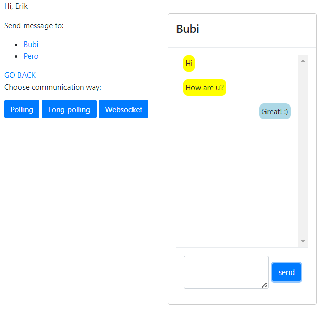

# Chat Application

This is a simple chat application that allows users to communicate with each other using different communication methods like polling, long-polling, and websockets. It is built using Flask, websockets and PHP.



## Table of Contents

- [Features](#features)
- [Technologies Used](#technologies-used)
- [Setup](#setup)
- [Usage](#usage)
- [File Structure](#file-structure)

## Features

- User registration and selection of user accounts.
- Real-time communication between users using various communication methods (polling, long-polling, websockets).
- Supports sending and receiving messages in real-time.

## Technologies Used

- **Frontend**:
  - HTML, CSS, JavaScript
  - jQuery
- **Backend**:
  - PHP
  - Flask (Python)
- **Database**:
  - MySQL
- **Websockets**:
  - websockets (Python library)
- **Other Tools**:
  - XAMPP

## Setup

1. **Clone the repository:**

    ```bash
    git clone <repository_url.git>
    ```

2. **Database Setup:**
   
    - Install XAMPP and start the MySQL server.
    - Import the database schema provided in `database_structure`.

3. **Server Setup:**
   
    - Navigate to the `server` directory.
    - Install required Python packages:
    
        ```bash
        pip install -r requirements.txt
        ```

4. **Run the Servers:**

    - Start the Flask server for the chat application.
    - Start the PHP server for the frontend.

5. **Access the Application:**

    - Open a web browser and go to `http://localhost:<port_number>` to access the chat application.

## Usage

1. **User Registration:**

    - Access the application and register your name.
    - Select your user account from the list of registered users.

2. **Communication:**

    - Choose communication method (polling, long-polling, websockets) on the interface.
    - Send and receive messages to/from other users.

## File Structure

- `/server`: Contains backend server files.
- `/`: Contains frontend files.
- `/database_structure`: Contains database schema and setup scripts.
